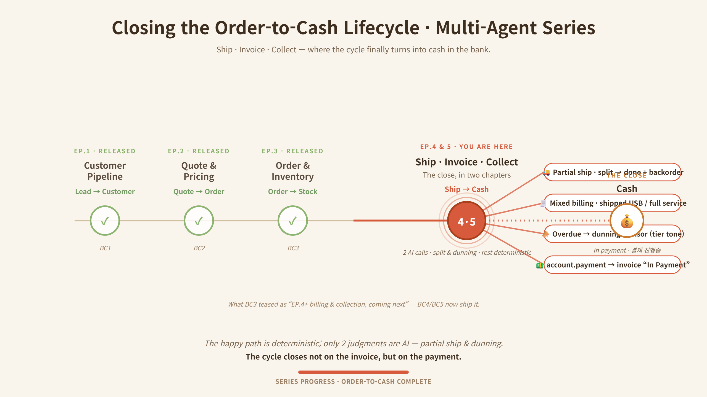

# OOSDK — Ontology-Oriented Multi-Agent Platform

**Business strategy as code.** OOSDK drives a multi-agent system from a single **ontology** (`ontology.yaml`) that encodes a company's policies and decision rules. Change one line of policy and the agents' collaboration and branching change — **no code redeploy**. The ontology defines *WHAT* (policy/intent); the agents handle *HOW* (execution) — so routine decisions can be made deterministically by policy rather than by an LLM call.

> The flagship of the **SunnyLab** build series. This is a **sanitized public showcase** — credentials, tokens, and infrastructure identifiers (GCP project, VM IP, Odoo tenant) were removed before publishing. Some modules require your own Odoo/Salesforce/GCP configuration to run end to end.



> **Order-to-cash now closes end-to-end** — from Lead all the way to a real `account.payment` ("In Payment") in Odoo. Across the whole cycle the LLM speaks in **exactly two seats** (how to ship a short order, and who to chase first and in what tone); everything else — allocation, dispatch, invoicing, payment — is deterministic policy. That boundary is a single yaml toggle.

## Core idea
```
ontology.yaml  (policy / strategy, human-editable)
        │   "WHAT to do, under which policy"
        ▼
Ontology Engine ── deterministic policy decisions ──►  Agents ("HOW", execution)
        │                                                 ├─ crm / erp / inventory / collections
        │                                                 ├─ cs / helpdesk / email / calendar
        └─ when needed: LLM reasoning + RAG               └─ analytics / report   (10 domain agents)
```
- **Policy-driven dispatch** — many decisions need *zero* LLM calls (cost + determinism)
- **LLM only where the answer depends on context** — caged as an *advisor*: whitelisted input, forced JSON, human approval, deterministic fallback if the model is off or fails
- **Extensible by design** — add a new domain agent on the same base; the ontology wires it in (the `collections_agent` was added this way to close the cycle)

## Business Case (BC) series — order-to-cash, end-to-end
A B2B sales-to-cash cycle automated across stages, integrating **Salesforce (SFDC)** and **Odoo ERP**. Design thesis: *the LLM speaks only in the few seats where the answer depends on context; the rest is deterministic policy.*
- **BC1 Customer pipeline** — inbound email → sender lookup → **tier routing**, zero LLM (first-match ontology rules), idempotent lead creation:
  - **VIP** → qualified lead + priority meeting booked within 24h + premium-tone invite
  - **Standard** → qualified lead + RAG-drafted reply on an 8h SLA
  - **New prospect** (unregistered) → lead (enrichment pending) + 24h welcome
- **BC2 Sales** — opportunity with **tier-differentiated pricing & process**, then ERP handoff on close:
  - **VIP** → 5-stage process, *negotiable* pricing (discount up to a cap, approval beyond)
  - **Standard** → 4-stage process, *list price* fixed (no discount authority)
  - **Closed Won** → Odoo **Sales Order** auto-created & confirmed (idempotent) + thank-you (+ VIP kickoff meeting); **Closed Lost** → LLM lost-reason analysis + 180-day re-engage task (no ERP push)
  - *contract = Opportunity → Sales Order*; pricing is deterministic, the only LLM call is Lost-reason analysis
- **BC3 Order & inventory** — confirmed SO → line split → deterministic allocation, with AI only where stock truly runs out:
  - **Line split** — storable → delivery, service → license activation
  - **Allocation (deterministic)** — VIP soft-preempt / Standard FIFO / partial-fill (Waiting) / re-allocate on stock receipt / batch pre-allocation, over a 4-state model (on-hand / reserved / available / incoming)
  - **Autonomous replenishment (AI)** — when no rule can fill the shortage: an LLM **qty advisor** sizes the purchase, creates the incoming picking, and writes an LLM **manager briefing** — both AI points fall back to rules
- **BC4 Ship · Invoice · Collect** — closing the cycle in cash:
  - **Ship** — partial-shipment **advisor** (split / wait) → human approve → one approval chains ship + invoice + notify
  - **Invoice** — deterministic **mixed billing** (per-line invoice policy: shipped qty vs. full); *no rule, no agent — by design*
  - **Collect** — dunning **advisor** (recovery priority + tier tone: VIP gentle / repeat-late firm) → approve → send + chatter → `account.payment` → invoice **"In Payment"**

> Two AI advisor seats (partial-shipment, dunning); everything between is deterministic, and both execute only after a human approves.

## Key capabilities
- **Ontology engine** that encodes business policy and drives multi-agent collaboration
- **10 multi-domain agents** (CRM, ERP, inventory, collections, CS, helpdesk, email, calendar, analytics, report) over **MCP / FastMCP**
- **Caged LLM advisors** — two-step `trigger → confirm`: the model only *recommends*, a human approves, and execution is deterministic (with a rule fallback if the model fails)
- **Order-to-cash close** — partial shipping, mixed-billing invoicing, and AR collections → real Odoo `account.payment`
- **Enterprise integration** — SFDC + Odoo ERP adapters; **RAG (ChromaDB)**; 3-tier memory (hot/warm/cold)
- **Bilingual Streamlit dashboard** (KR/EN) — decisions, inventory, ontology stats
- **Cloud-native** — Docker, Cloud Build, GitHub Actions (project/VM values are placeholders)

## Tech stack
Python · MCP / FastMCP · Ontology-driven orchestration · Salesforce & Odoo ERP · ChromaDB (RAG) · Streamlit · Docker · Google Cloud · GitHub Actions

## Project structure
```
ontology/            # ontology.yaml — business policy as code
mcp_server/          # ontology engine, domain agents, tools, adapters (SFDC/Odoo)
dashboard_modules/   # dashboard components
dashboard.py / dashboard_en.py   # Streamlit dashboards (KR/EN)
scripts/             # BC1-BC4 business-case demos & setup
assets/              # order-to-cash lifecycle diagram
tests/               # unit tests
.env.example         # required env vars (no real keys)
```

## Setup
```bash
cp .env.example .env      # configure OpenAI/Google, Salesforce, Odoo (your own)
pip install -r requirements.txt
# run the MCP server (see mcp_server/) and a dashboard:
streamlit run dashboard.py
```

## Note
Public **portfolio showcase** of an actively evolving project. For safety, all secrets/credentials and infra identifiers were stripped; external integrations (Odoo, Salesforce, GCP) require your own configuration. Architecture write-ups and demos: SunnyLab below.

---
**SunnyLab** — building agentic AI in public · Medium [@sunnylabtv](https://medium.com/@sunnylabtv) · YouTube [@sunnylabtv](https://www.youtube.com/@sunnylabtv)
